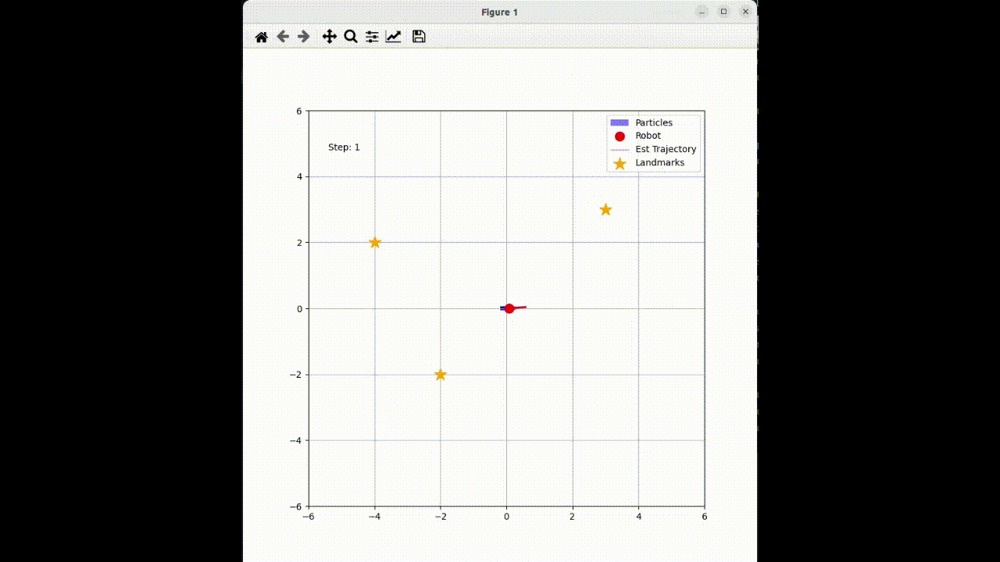

# MCL_for_class

パーティクルフィルタを用いた2次元ロボット自己位置推定のシミュレーション

こちらのリポジトリは確率ロボティクスの授業の課題として作成したものです．

## 概要

2次元平面上を移動するロボットのモンテカルロ自己位置推定（MCL: Monte Carlo Localization）のシミュレーションスクリプト([mcl_2d.py](https://github.com/ryotaema/MCL_for_class/blob/main/mcl_2d.py))です． 

## 実行例
[mcl_2d.py](https://github.com/ryotaema/MCL_for_class/blob/main/mcl_2d.py)
上記スクリプトを実行すると以下のような画面が現れ，ロボットが円周軌道上を移動します．ロボットは移動時にスリップとセンサのノイズを含むような設定になっています．
ランドマーク付近を通貨した際に進行方向に伸びていたパーティクルが集合していることを確認できます．赤い線はMCLによって推定された軌跡であり，赤丸で示すロボットの軌道と概ね一致していることがわかる．




## MCL（Monte Carlo Localization）とは

MCLは，パーティクルフィルタに基づく自己位置推定アルゴリズムです．
多数の「パーティクル」を用いて，ロボットの位置の確率分布を表現し，センサー観測に基づいて位置を推定します．

## 動作環境

以下の環境で動作を確認しています．

* **OS: Ubuntu 22.04**
* **Python 3.10**

### インストール方法

必要なライブラリがない場合は，以下のコマンドでインストールしてください．

```bash
pip install numpy matplotlib scipy
```

```bash
git clone https://github.com/ryotaema/MCL_for_class.git
```

## 実行方法
スクリプトをターミナル（またはコマンドプロンプト）から直接実行してください．

```Bash
python mcl_2d.py
```

実行するとウィンドウが立ち上がり，シミュレーションのアニメーションが開始されます．

* 赤い点: 真のロボットの位置

* 赤い線: MCLによって推定されたロボットの軌跡

* 青い矢印: パーティクル（位置と向きの仮説）

* オレンジの星: ランドマーク（目印）

## シミュレーション設定

以下に本スクリプトの実行環境およびパラメータを示す．

### 環境
- **ランドマーク**: 3箇所
    * (-2,2) 
    * (3,3) 
    * (-2,-1)
- **ロボットの動作**: 円形軌道
- **センサノイズ設定 (Sensor Noise):**
    * **距離計測:** 計測距離の $20\%$の誤差 (`distance_dev_rate=0.2`)
    * **方位計測:** $0.05$ [rad] の誤差 (`direction_dev=0.05`)

### パラメータ
- **パーティクル数**: 100個
- **ステップ数**: 300
- **動作ノイズ設定 (Motion Noise):**
    * 移動に伴う不確実性を再現するため，以下の分散係数を設定しています．（値が大きいほど移動ごとの拡散が激しくなります）．
    * 設定値: `{"nn":0.5, "no":0.5, "on":0.5, "oo":0.5}`
        * `nn`: 直進時の直進方向のばらつき
        * `no`: 直進時の回転方向のばらつき
        * `on`: 回転時の直進方向のばらつき
        * `oo`: 回転時の回転方向のばらつき

## アルゴリズム

本シミュレータでは，以下の数理モデルに基づいてロボットの状態遷移と観測更新を行っています。

### 1. 状態遷移モデル (Motion Model)
ロボットの状態を $\mathbf{x}_t = (x_t, y_t, \theta_t)^T$，制御入力を $\mathbf{u}_t = (v_t, \omega_t)^T$（並進速度、角速度）とします．
時間刻み $\Delta t$ における状態遷移は，以下のオドメトリ動作モデル（速度運動モデル）に従います．

$$
\begin{pmatrix} x_t \\ y_t \\ \theta_t \end{pmatrix} = \begin{pmatrix} x_{t-1} \\ y_{t-1} \\ \theta_{t-1} \end{pmatrix} + \begin{pmatrix} \frac{\hat{v}_t}{\hat{\omega}_t} (\sin(\theta_{t-1} + \hat{\omega}_t \Delta t) - \sin\theta_{t-1}) \\ \frac{\hat{v}_t}{\hat{\omega}_t} (-\cos(\theta_{t-1} + \hat{\omega}_t \Delta t) + \cos\theta_{t-1}) \\ \hat{\omega}_t \Delta t \end{pmatrix}
$$

ここで，実環境での不確実性を再現するため，実際の制御入力にはガウス分布に従うノイズ $\varepsilon$ が混入された値 $(\hat{v}_t, \hat{\omega}_t)$ が使用されます．

$$
\begin{aligned}
\hat{v}_t &= v_t + \varepsilon_{v} \\
\hat{\omega}_t &= \omega_t + \varepsilon_{\omega}
\end{aligned}
$$

### 2. 観測モデル (Measurement Model)
地図上のランドマーク $m_j$ の位置を $(m_{j,x}, m_{j,y})$ としたとき，ロボットから見たランドマークの距離 $r$ と方位角 $\phi$ は以下のように計算されます．

$$
\mathbf{z}_{pred} = \begin{pmatrix} r \\ \phi \end{pmatrix} = \begin{pmatrix} \sqrt{(m_{j,x} - x_t)^2 + (m_{j,y} - y_t)^2} \\ \text{atan2}(m_{j,y} - y_t, m_{j,x} - x_t) - \theta_t \end{pmatrix}
$$

### 3. 尤度計算 (Likelihood Update)
実際のセンサ観測値 $$\mathbf{z}_{obs}$$ と、各パーティクルの位置から予測される観測値 $$\mathbf{z}_{pred}$$ との差（誤差）に基づき、そのパーティクルの尤度（重み $w$）を算出します。誤差分布には多変量ガウス分布を仮定しています。

また，パーティクルの軌跡に関しては，全パーティクルの重み付き平均を計算することで，軌跡をなめらかにしている．

ここで $\Sigma$ はセンサのノイズ共分散行列であり、距離に比例して誤差が大きくなる特性をモデル化しています。

## 参考
上田隆一『詳解 確率ロボティクス -Pythonによる基礎アルゴリズムの実装-』講談社, 2019年.